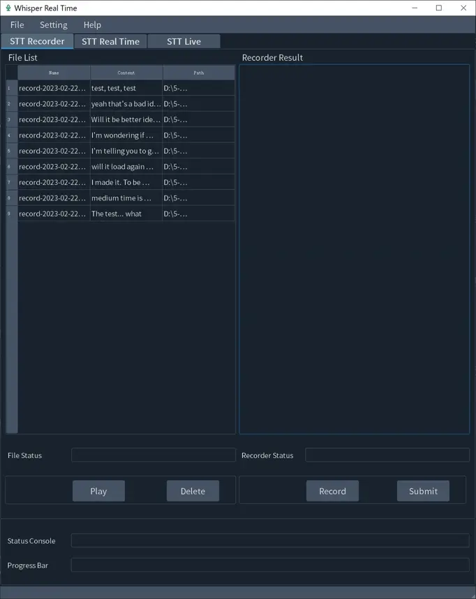
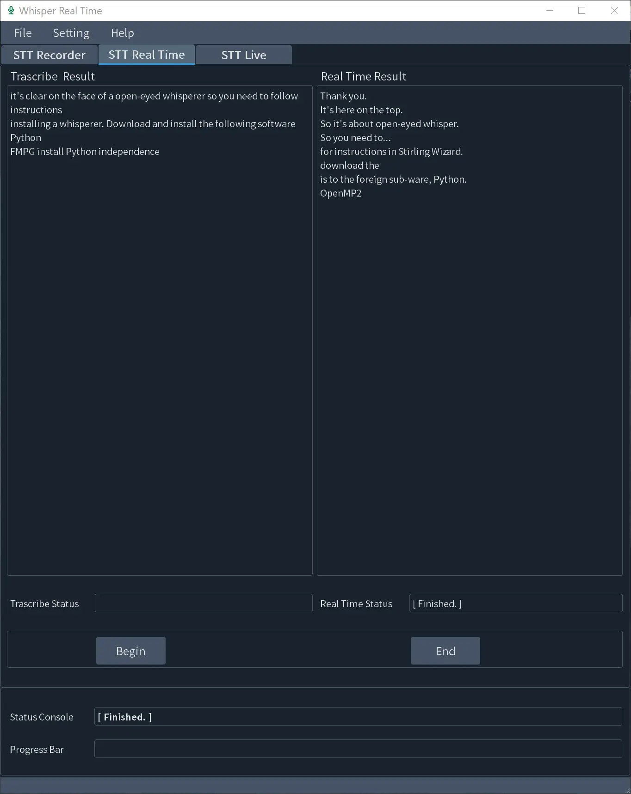
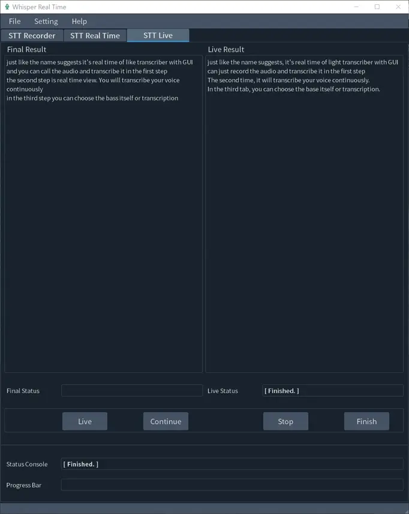

# Whisper Real Time Document

Project whisper-real-time.

## Project description

What can whisper-real-time do for you?

Just as the name suggests, it is a real time offline transcriber with GUI.

## Features

Why choose whisper-real-time?

### 1. Real time:

customise the delay seconds yourself.

### 2. Three modes of transcription:

Record mode, Real Time mode, Live mode.

### 3. Offline totally:

no online API, no privacy issues, no time limits.

## Usage

### 1. The first tab

You could record the audio and transcribe it in the first tab.



Play: play the audio file selected (or double-click the item in the table).

Delete: delete the audio file selected.

Record: start recording.

Submit: stop recording and transcribe the audio record.

### 2. The second tab

The second tab is the real time zone, it will transcribe your voice continuously.



Begin: start recording and transcribe automatically.

End: stop recording and transcribe the whole audio record.

### 3. The third tab

In the third tab, you could control the pace of transcription yourself.



Live: start recording or transcribe the previous part and keep recording.

Continue: give up the previous part and keep recording.

stop: stop recording and give up the transcription.

Finish: stop recording and transcribe the whole audio record.

## Installation

It is build on the base of OpenAI whisper, so you need to follow the instruction of installing whisper.

whisper document: https://github.com/openai/whisper

**Main steps of Installation:**

### 1. Download and install software

Download and install the following software (go to next step if installed already):

Python 3.10: https://www.python.org/downloads/release/python-31010/

FFmpeg: https://ffmpeg.org/download.html

### 2. Install the python packages

Install the python packages automatically by requirements.txt:

```shell
pip install -r requirements.txt
```

### 3. Run `main.py`

Run the `main.py` file with python.

## Tips

### 1. First time installation

The process of downloading whisper model to your device might take about several minutes, so it needs patience when the
first time you start the transcription after the installation.

### 2. First transcription task after startup

The process of loading whisper model to RAM might take about ten seconds, so it is better to waite until the text box
show the words when the first transcription task start after you start up whisper-real-time every time.

### 3. Customization

The default configuration is not suit for everyone, so make some modifications in language or model type may make the
result better.

### 4. Supported Platforms

Python can be run on varies of operating systems, but whisper-real-time was developed on Windows system, hadn't been
verified in other systems such as Mac and Linux, so there may be some bugs on these systems...

## Reference

Official Website: https://dovej.com

Document: https://www.dovej.com/blog/003-whisper-real-time-document

GitHub: https://github.com/doveg/whisper-real-time

